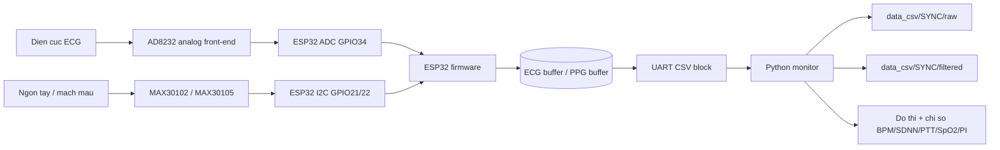
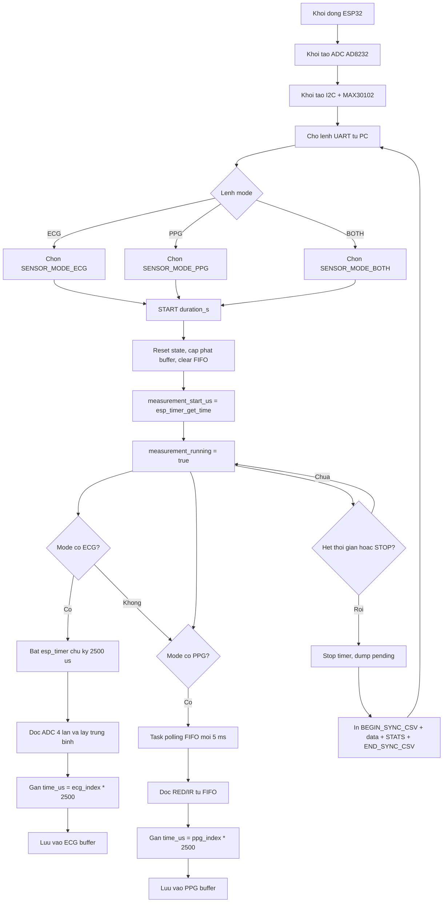
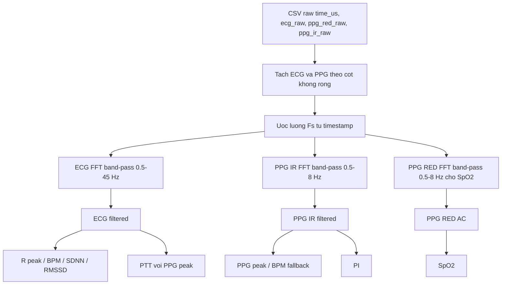

# ECG_PPG_SYNC

Du an thu dong bo tin hieu ECG tu module AD8232 va PPG tu MAX30102/MAX30105 bang ESP32, sau do gui block du lieu CSV ve PC qua UART. Ung dung Python doc UART, luu CSV, loc tin hieu bang band-pass va tinh cac chi so sinh ly co ban.

Phien ban hien tai da chuyen sang:

- ECG va PPG cung tan so lay mau danh dinh `400 Hz`.
- Dong bo theo mau bang timestamp `time_us`.
- Bo pipeline tru baseline va wavelet.
- Chi dung bo loc thong dai band-pass cho ECG va PPG.
- Co 2 monitor PC:
  - `monitor.py`: do rieng `ECG` hoac `PPG`.
  - `monitor_sync_uart.py`: do dong bo `BOTH`, hien thi 4 do thi rieng.

> Luu y: du lieu va chi so trong project phuc vu hoc tap/thu nghiem xu ly tin hieu, khong phai thiet bi y te. ECG hien la ADC count cua ESP32, PPG la optical count cua MAX30102, chua calibration sang don vi y sinh tuyet doi.

---

## 1. Cau truc phan cung

### Cam bien

| Tin hieu | Module | Ket noi voi ESP32 | Du lieu |
|---|---|---|---|
| ECG | AD8232 | OUT -> GPIO34 / ADC1_CHANNEL_6 | ADC 12 bit, `0..4095` |
| PPG | MAX30102/MAX30105 | I2C SDA GPIO21, SCL GPIO22 | RED/IR 18 bit |

### Cau hinh chinh trong firmware

File cau hinh: `src/Sensor_init/sensor_init.h`

```c
// MAX30102
#define sampleAverage 1
#define sampleRate    400

// AD8232 ECG
#define ADC_SAMPLE_RATE 400
#define ECG_ADC_OVERSAMPLE_COUNT 4

// Timestamp/sample period
#define ECG_TIMER_PERIOD_US         (1000000 / ADC_SAMPLE_RATE)
#define PPG_EFFECTIVE_SAMPLE_RATE   (sampleRate / sampleAverage)
#define PPG_SAMPLE_PERIOD_US        ((1000000 * sampleAverage) / sampleRate)
```

Voi cau hinh nay:

```text
Fs_ECG = 400 Hz
Fs_PPG = 400 / 1 = 400 Hz
T_sample = 1 / 400 = 0.0025 s = 2500 us
```

---

## 2. Luu do he thong



Du lieu khong stream tung mau realtime. Firmware thu mau vao RAM trong thoi gian do, sau do dump toan bo block CSV ve PC. Cach nay giup viec do o 400 Hz on dinh hon, tranh UART lam cham timer doc ADC/FIFO.

---

## 3. Luu do hoat dong firmware



### Dong bo theo mau

ECG va PPG duoc gan moc thoi gian theo chi so mau:

```text
time_us[n] = n * 2500
```

Voi mode `BOTH`, neu ECG va PPG cung chi so mau `n`, chung co cung `time_us`, nen khi dump CSV se nam chung mot dong:

```text
time_us,ecg_raw,ppg_red_raw,ppg_ir_raw
0,ecg0,red0,ir0
2500,ecg1,red1,ir1
5000,ecg2,red2,ir2
...
```

---

## 4. File va thu muc quan trong

| File/thu muc | Vai tro |
|---|---|
| `platformio.ini` | Cau hinh build PlatformIO cho ESP32/ESP-IDF |
| `src/main/PPG_PCG_ECG.c` | Nhan lenh UART `ECG`, `PPG`, `BOTH`, `START`, `STOP` |
| `src/Sensor_init/sensor_init.h` | Cau hinh chan, tan so lay mau, struct sample |
| `src/Sensor_init/sensor_init.c` | Khoi tao cam bien, lay mau, dong bo, dump CSV |
| `components/max30105/` | Driver MAX30102/MAX30105 |
| `monitor.py` | UI do rieng ECG hoac PPG |
| `monitor_sync_uart.py` | UI do dong bo BOTH, hien thi 4 do thi |
| `data_csv/SYNC/raw/` | CSV raw tu UART |
| `data_csv/SYNC/filtered/` | CSV sau band-pass |

---

## 5. Monitor PC

### 5.1. `monitor.py`

Dung de do rieng tung tin hieu:

- Mode `ECG`: do va ve ECG.
- Mode `PPG`: do va ve PPG.
- Co 2 do thi:
  - Raw signal: mau den.
  - Bandpass filtered signal: mau do.

Chay:

```powershell
python monitor.py
```

### 5.2. `monitor_sync_uart.py`

Dung de do dong bo ca ECG va PPG:

- Chi co mode `BOTH`.
- Ben trai: control, UART log, BPM, SDNN, RMSSD, PTT, SpO2, PI.
- Ben phai: 4 do thi rieng:
  - ECG raw.
  - ECG bandpass.
  - PPG IR raw.
  - PPG IR bandpass.

Chay:

```powershell
python monitor_sync_uart.py
```

---

## 6. Luu do xu ly tin hieu qua band-pass



Pipeline hien tai khong con cac buoc:

- Tru baseline de ve do thi.
- Moving average trend removal cho PPG.
- Wavelet denoise.
- Notch rieng 50 Hz.

Thanh phan DC duoc loai bo boi band-pass vi tan so `0 Hz` nam ngoai dai thong.

---

## 7. Cong thuc band-pass

Monitor dung band-pass trong mien tan so bang FFT.

Voi chuoi mau:

```text
x[n], n = 0, 1, ..., N-1
```

Bien doi Fourier roi rac:

```text
X[k] = sum_{n=0}^{N-1} x[n] * exp(-j * 2*pi*k*n/N)
```

Tan so ung voi bin `k`:

```text
f_k = k * Fs / N
```

Ham truyen band-pass ly tuong:

```text
H[k] = 1, neu f_low <= f_k <= f_high
H[k] = 0, neu nguoc lai
```

Pho sau loc:

```text
Y[k] = X[k] * H[k]
```

Tin hieu sau loc:

```text
y[n] = IFFT(Y[k])
```

Trong code:

```python
spectrum = np.fft.rfft(values)
freqs = np.fft.rfftfreq(len(values), d=1.0 / sample_rate_hz)
keep = (freqs >= highpass_hz) & (freqs <= lowpass_hz)
spectrum[~keep] = 0
filtered = np.fft.irfft(spectrum, n=len(values))
```

### Dai tan dang dung

| Tin hieu | Dai band-pass |
|---|---|
| ECG | `0.5 - 45 Hz` |
| PPG IR | `0.5 - 8 Hz` |
| PPG RED | `0.5 - 8 Hz` |

Voi `Fs = 400 Hz`, tan so Nyquist la:

```text
F_Nyquist = Fs / 2 = 200 Hz
```

Nen cac dai loc tren deu nam hop le trong mien tan so.

---

## 8. Uoc luong tan so lay mau tu timestamp

Monitor tinh `Fs` tu timestamp thay vi tin tuyet doi vao cau hinh:

```text
dt_ms[i] = time_ms[i+1] - time_ms[i]
Fs = 1000 / median(dt_ms)
```

Voi dong bo 400 Hz:

```text
dt_ms = 2.5 ms
Fs = 1000 / 2.5 = 400 Hz
```

---

## 9. Phat hien R peak ECG

Tin hieu dung de tim R peak la ECG sau band-pass:

```text
y_ecg[n]
```

Trong code, peak detector dung bien do tuyet doi de bat R peak ca khi dang song dao pha:

```text
s[n] = abs(y_ecg[n])
```

Sau do chi de tinh nguong, detector dua `s[n]` quanh muc trung vi:

```text
s_c[n] = s[n] - median(s)
```

Do lon nhieu robust:

```text
MAD = median(abs(s_c[n] - median(s_c)))
MAD_robust = 1.4826 * MAD
```

Nguong ung vien R peak:

```text
threshold = max(median(s_c) + 2.8 * MAD_robust, percentile_70(s_c))
```

Dieu kien ung vien cuc dai:

```text
s_c[n] >= s_c[n-1]
s_c[n] >  s_c[n+1]
s_c[n] >  threshold
```

Khoang cach toi thieu giua 2 R peak:

```text
min_distance = 0.28 s
min_distance_samples = round(0.28 * Fs)
```

Neu nhieu ung vien qua gan nhau, code giu ung vien co bien do lon hon.

---

## 10. Phat hien PPG peak

Tin hieu dung de tim PPG peak la PPG IR sau band-pass:

```text
y_ppg[n]
```

PPG co the dao pha tuy cach dat cam bien, nen code thu ca hai huong:

```text
y_ppg[n]
-y_ppg[n]
```

Peak detector cho PPG dung:

```text
threshold_scale = 0.45
min_distance = 0.35 s
```

Neu co ECG peak, code chon tap PPG peak co so luong gan voi so ECG peak hon. Neu khong co ECG, code chon huong co nhieu peak hop le hon.

---

## 11. Cong thuc BPM

Sau khi co cac peak time:

```text
t_R[0], t_R[1], ..., t_R[M-1]
```

Khoang RR:

```text
RR_i = t_R[i] - t_R[i-1]
```

Chi chap nhan RR trong khoang:

```text
300 ms <= RR_i <= 2000 ms
```

BPM tuc thoi duoc tinh tu RR cuoi cung:

```text
BPM = 60000 / RR_last
```

Neu khong du R peak ECG, monitor fallback sang PPG peak:

```text
BPM = 60000 / PP_i_last
```

Trong do `PP_i` la khoang cach giua hai PPG peak lien tiep.

---

## 12. Cong thuc SDNN va RMSSD

Dung chuoi RR hop le tu ECG:

```text
RR_1, RR_2, ..., RR_N
```

### SDNN

```text
RR_mean = (1/N) * sum(RR_i)
SDNN = sqrt( sum((RR_i - RR_mean)^2) / (N - 1) )
```

Don vi: `ms`.

### RMSSD

```text
d_i = RR_{i+1} - RR_i
RMSSD = sqrt( mean(d_i^2) )
```

Don vi: `ms`.

---

## 13. Cong thuc PTT

PTT trong project hien duoc tinh tu R peak ECG den PPG peak sau do:

```text
PTT_i = t_PPG_peak_i - t_R_peak_i
```

Voi moi R peak, code tim PPG peak dau tien nam trong cua so:

```text
80 ms <= PTT_i <= 600 ms
```

Gia tri hien thi:

```text
PTT = median(PTT_i)
```

> Luu y: PTT nay la `R-to-PPG peak`, khong phai `R-to-PPG foot`. Neu can PTT chuan hon cho mach mau, nen phat hien foot cua song PPG thay vi dinh PPG.

---

## 14. Cong thuc SpO2

Project tinh SpO2 gan dung tu RED va IR cua MAX30102.

Thanh phan DC:

```text
RED_DC = mean(RED_raw)
IR_DC  = mean(IR_raw)
```

Thanh phan AC lay tu band-pass:

```text
RED_AC = RMS(RED_bandpass)
IR_AC  = RMS(IR_bandpass)
```

Ti so R:

```text
R = (RED_AC / RED_DC) / (IR_AC / IR_DC)
```

Cong thuc SpO2 gan dung:

```text
SpO2 = 110 - 25 * R
```

Code gioi han ket qua:

```text
70% <= SpO2 <= 100%
```

> Luu y: cong thuc nay can calibration neu muon dung nghiem tuc. Gia tri SpO2 tu module va LED current co the lech theo ngon tay, ap luc dat cam bien, anh sang moi truong va dac tinh module.

---

## 15. Cong thuc PI

Perfusion Index duoc tinh tu kenh IR:

```text
IR_DC = mean(IR_raw)
IR_AC = RMS(IR_bandpass)
```

```text
PI_percent = 100 * IR_AC / IR_DC
```

PI cao hon thuong cho thay bien do mach dap PPG ro hon. Neu PI rat thap, co the do ngon tay dat long, LED qua yeu, cam bien lech vi tri, hoac mach ngoai vi yeu.

---

## 16. Chat luong tin hieu va clipping

### ECG clipping

ADC ESP32 12 bit co mien:

```text
0 .. 4095
```

Firmware/monitor danh dau clipping ECG khi:

```text
ecg_raw <= 20
ecg_raw >= 4075
```

Ty le clipping:

```text
clip_percent = 100 * (clip_low_count + clip_high_count) / N_ecg
```

Neu ECG cham 0 hoac 4095 nhieu, do thi sau band-pass cung khong dang tin vi tin hieu da bi mat thong tin truoc khi loc.

Nguyen nhan thuong gap:

- Dien cuc ECG tiep xuc kem.
- Day RA/LA/RL sai vi tri hoac long.
- Nguoi do/ESP32 gan adapter, day dien, nguon nhieu 50 Hz.
- Laptop dang cam sac gay nhieu common-mode.
- AD8232/ADC bi saturation do offset hoac tin hieu qua lon.

### PPG saturation

MAX30102 la ADC 18 bit:

```text
0 .. 262143
```

Monitor canh bao PPG saturated khi:

```text
ppg_raw >= 0.95 * 262143
```

Neu PPG gan tran hoac gan phang:

- Giam/tang LED current.
- Dat ngon tay lai.
- Che anh sang moi truong.
- Kiem tra nguon 3.3 V va I2C.

---

## 17. Dinh dang CSV

### CSV raw tu monitor

File nam trong:

```text
data_csv/SYNC/raw/
```

Header:

```text
person_name,time_us,time_ms,ecg_raw,ppg_red_raw,ppg_ir_raw
```

Y nghia:

| Cot | Y nghia |
|---|---|
| `person_name` | Ten nguoi do |
| `time_us` | Timestamp microsecond theo sample index |
| `time_ms` | Timestamp millisecond de doc va ve |
| `ecg_raw` | ADC count tu AD8232 |
| `ppg_red_raw` | RED count tu MAX30102 |
| `ppg_ir_raw` | IR count tu MAX30102 |

### CSV filtered

File nam trong:

```text
data_csv/SYNC/filtered/
```

Header dang:

```text
person_name,time_us,time_ms,
ecg_raw,ecg_bandpass_0.5_45Hz,
ppg_ir_raw,ppg_ir_bandpass_0.5_8Hz,
ppg_red_raw
```

---

## 18. Lenh build, upload va chay monitor

Dung terminal tai thu muc project co `platformio.ini`:

```powershell
cd D:\VXL.20251\ECG_PPG_SYNC\ECG_PPG_SYNC
```

### Cai thu vien Python

```powershell
python -m pip install pyserial numpy matplotlib
```

### Build firmware

```powershell
python -m platformio run
```

### Upload ESP32

```powershell
python -m platformio run --target upload
```

Neu can chi ro cong COM:

```powershell
python -m platformio run --target upload --upload-port COM5
```

### Chay monitor do rieng

```powershell
python monitor.py
```

### Chay monitor do dong bo BOTH

```powershell
python monitor_sync_uart.py
```

---

## 19. Lenh UART firmware ho tro

| Lenh | Y nghia |
|---|---|
| `ECG` | Chon do ECG |
| `PPG` | Chon do PPG |
| `BOTH` | Chon do dong bo ECG + PPG |
| `START 10` | Do trong 10 giay |
| `STOP` | Dung do va dump CSV |
| `STATUS` | In trang thai firmware |

Monitor Python tu dong gui cac lenh nay, nguoi dung thuong khong can go tay.

---

## 20. Ghi chu ve gioi han hien tai

- Timestamp la dong bo theo sample index, khong phai timestamp phan cung rieng cua tung mau MAX30102.
- PPG van duoc doc qua FIFO bang polling, chua dung interrupt pin cua MAX30102.
- Band-pass FFT la loc offline tren ca block CSV, khong phai loc realtime tren ESP32.
- ECG chua doi sang mV sinh hoc vi chua co calibration gain AD8232 va ADC ESP32.
- SpO2 la cong thuc gan dung, chua calibration.
- PTT hien dung PPG peak; neu can nghien cuu mach mau nghiem tuc nen them PPG foot detection.
- Neu ECG raw bi clipping manh, khong co bo loc nao co the phuc hoi dang ECG dung.

