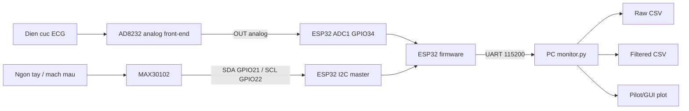
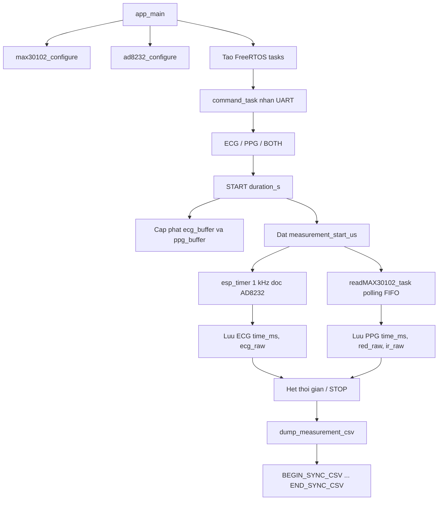
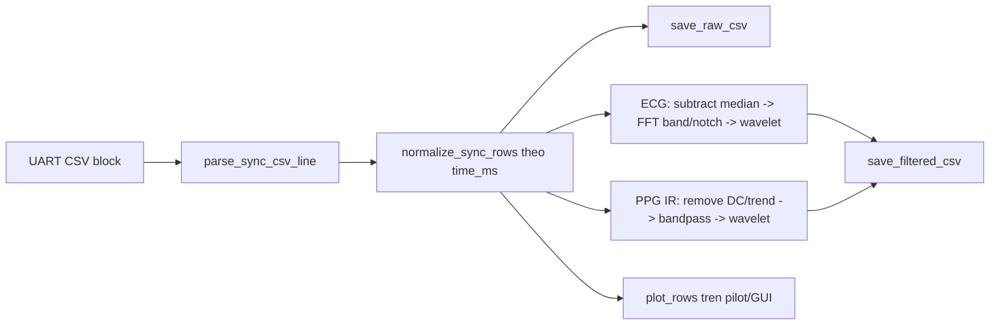
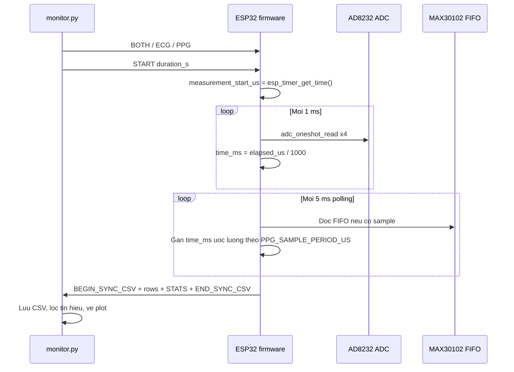

# ECG_PPG_SYNC

Du an nay dung ESP32 de thu dong bo 2 tin hieu:

- ECG analog tu module AD8232 qua ADC cua ESP32.
- PPG tu MAX30102/MAX30105 qua giao thuc I2C, gom 2 kenh `RED` va `IR`.

Firmware nhan lenh tu PC qua UART, do trong mot khoang thoi gian, luu mau vao RAM, sau do dump ca block CSV ve PC. Ung dung `monitor.py` nhan CSV, luu file raw, loc tin hieu va ve do thi ECG/PPG.

## Tong quan luong du lieu

```text
AD8232 OUT -> ESP32 ADC GPIO34 -> ecg_buffer
MAX30102 RED/IR -> I2C FIFO -> ppg_buffer

PC monitor.py -> UART command -> ESP32
ESP32 -> UART CSV block -> monitor.py
monitor.py -> raw CSV + filtered CSV + plot
```

Firmware khong stream tung sample realtime. Du lieu chi duoc gui ve PC sau khi ket thuc phien do. Cach nay giup UART khong lam cham viec lay mau ECG 1 kHz.

## Cac so do he thong can co

### So do khoi phan cung



### So do luong firmware



### So do xu ly tren PC



### So do dong bo thoi gian



## Cau truc file

- `platformio.ini`: cau hinh PlatformIO, board `esp32dev`, framework ESP-IDF, baud `115200`.
- `src/main/PPG_PCG_ECG.c`: ham `app_main`, tao cac task FreeRTOS va task nhan lenh UART.
- `src/Sensor_init/sensor_init.h`: khai bao pin, sample rate, mode do, struct sample va API dieu khien sensor.
- `src/Sensor_init/sensor_init.c`: logic chinh de khoi tao ADC/I2C, lay mau, timestamp, buffer, stop va dump CSV.
- `components/max30105/max30105.c`: driver I2C cho MAX30102/MAX30105.
- `components/max30105/include/max30105.h`: struct va prototype cua driver MAX30105.
- `monitor.py`: GUI Tkinter tren PC de dieu khien ESP32, doc UART, luu CSV, loc FFT/wavelet va ve do thi.
- `data_csv/SYNC/raw/`: du lieu raw da thu.
- `data_csv/SYNC/filtered/`: du lieu da loc.
- `src/CMakeLists.txt`: dang gom `main/PPG_PCG_ECG.c` va `Sensor_init/sensor_init.c` vao build ESP-IDF.

## Cau hinh phan cung

### ESP32

- Board: `esp32dev`
- Framework: ESP-IDF
- UART baud: `115200`

### AD8232 ECG

Trong `sensor_init.h`:

```c
#define ADC_CHANNEL   ADC_CHANNEL_6 // GPIO34
#define ADC_UNIT      ADC_UNIT_1
#define ADC_ATTEN     ADC_ATTEN_DB_12
#define ADC_SAMPLE_RATE 1000
#define ECG_ADC_OVERSAMPLE_COUNT 4
```

Ket noi chinh:

- AD8232 `OUT` -> ESP32 `GPIO34`
- AD8232 `GND` -> ESP32 `GND`
- AD8232 `3.3V` -> ESP32 `3.3V`

Repo hien tai chua doc chan `LO+` va `LO-`, nen firmware chua biet luc nao dien cuc bi roi. Neu dien cuc roi, ADC van co the hien thi tin hieu nhieu hoac duong gan phang.

### MAX30102 PPG

Trong `sensor_init.h`:

```c
#define I2C_SDA_GPIO  21
#define I2C_SCL_GPIO  22
#define I2C_PORT      I2C_NUM_0
#define I2C_FREQ_HZ   400000

#define powerLed      UINT8_C(0x1F)
#define sampleAverage 4
#define ledMode       2
#define sampleRate    100
#define pulseWidth    411
#define adcRange      16384
```

Ket noi chinh:

- MAX30102 `SDA` -> ESP32 `GPIO21`
- MAX30102 `SCL` -> ESP32 `GPIO22`
- MAX30102 `VIN` -> `3.3V` hoac nguon phu hop voi module
- MAX30102 `GND` -> ESP32 `GND`

Dia chi I2C cua MAX30102/MAX30105 trong driver:

```c
#define MAX30105_ADDRESS 0x57
```

## Co che lay analog tu AD8232

AD8232 la module analog front-end cho ECG. Module nay khuech dai va loc so bo tin hieu ECG tu dien cuc, sau do dua ra dien ap analog o chan `OUT`. ESP32 doc dien ap nay bang ADC.

### ADC 12 bit

Firmware cau hinh ADC 12 bit:

```c
.bitwidth = ADC_BITWIDTH_12
```

Gia tri ADC raw nam trong khoang:

```text
0 .. 4095
```

Cong thuc gan dung:

```text
adc_raw = Vin / Vref_effective * 4095
Vin ~= adc_raw / 4095 * Vref_effective
```

Voi ESP32, `Vref_effective` phu thuoc chip, attenuation va calibration. Repo hien tai luu `ecg_raw` truc tiep, chua convert sang volt hoac mV.

### Baseline va peak ECG

AD8232 thuong bias tin hieu quanh mot muc DC nam giua nguon, vi ECG co ca thanh phan am/duong neu nhin theo sinh hoc. Vi vay raw khong dao dong quanh 0, ma thuong quanh mot baseline ADC, vi du:

```text
baseline raw ~= 1700..1900
R peak raw   ~= 2400..2800
```

Trong `monitor.py`, khi ve ECG raw, code tru median:

```python
ecg_baseline = np.nanmedian(ecg[ecg_mask])
ecg = ecg - ecg_baseline
```

Do do do thi hien thi la `ECG centered`, khong phai raw tuyet doi.

### Oversampling ADC

Moi mau ECG duoc doc ADC 4 lan roi lay trung binh:

```c
for(int i = 0; i < ECG_ADC_OVERSAMPLE_COUNT; i++){
  adc_oneshot_read(adc_handle, ADC_CHANNEL, &raw);
  sum += raw;
}
return (sum + count / 2) / count;
```

Cong thuc:

```text
ecg_raw[n] = round((x1 + x2 + x3 + x4) / 4)
```

Muc dich:

- Giam nhieu ADC ngau nhien.
- Lam gia tri doc on dinh hon.
- Doi lai moi sample ton them thoi gian doc ADC.

## Timer ngat lay mau ECG

ECG duoc lay mau bang `esp_timer` periodic trong `sensor_init.c`.

Trong `sensor_init.h`:

```c
#define ADC_SAMPLE_RATE 1000
#define ECG_TIMER_PERIOD_US (1000000 / ADC_SAMPLE_RATE)
```

Cong thuc chu ky:

```text
T_ecg_us = 1,000,000 / Fs_ecg
T_ecg_us = 1,000,000 / 1000 = 1000 us = 1 ms
```

Ham callback:

```c
static void ecg_timer_callback(void *arg)
```

Moi lan callback:

1. Kiem tra co dang do va mode co ECG khong.
2. Doc ADC AD8232 bang `read_ecg_raw()`.
3. Lay timestamp theo `esp_timer_get_time() - measurement_start_us`.
4. Ghi vao `ecg_buffer`.

Timestamp:

```text
elapsed_us = esp_timer_get_time() - measurement_start_us
time_ms = elapsed_us / 1000
```

Firmware co thong ke jitter:

```text
period_us = actual_us[n] - actual_us[n-1]
```

Va dump:

```text
ECG_MIN_PERIOD_US
ECG_MAX_PERIOD_US
```

Neu he thong bi ban, `period_us` co the lech khoi 1000 us.

## Co che doc MAX30102 qua I2C

MAX30102 la cam bien quang hoc PPG. No co LED do `RED`, LED hong ngoai `IR`, photodiode va ADC noi bo. ESP32 khong doc analog truc tiep tu MAX30102. ESP32 doc du lieu so tu FIFO cua MAX30102 qua I2C.

### I2C la gi trong project nay

I2C dung 2 duong:

- `SDA`: du lieu
- `SCL`: clock

ESP32 la master, MAX30102 la slave co dia chi `0x57`.

Cau hinh:

```c
i2c_config_t conf = {
  .mode = I2C_MODE_MASTER,
  .sda_io_num = sda_pin,
  .scl_io_num = scl_pin,
  .sda_pullup_en = GPIO_PULLUP_ENABLE,
  .scl_pullup_en = GPIO_PULLUP_ENABLE,
  .master.clk_speed = i2c_speed_hz,
};
```

Toc do:

```text
f_i2c = 400000 Hz = 400 kHz
```

### Ghi thanh ghi I2C

Driver ghi thanh ghi bang:

```c
i2c_master_write_to_device(port, addr, data, len, timeout)
```

Goi tin ghi co dang:

```text
START -> address 0x57 write -> register -> value -> STOP
```

Vi du cau hinh LED:

```c
write_reg(sensor, MAX30105_LED1_PULSEAMP, power_level);
write_reg(sensor, MAX30105_LED2_PULSEAMP, power_level);
```

### Doc thanh ghi I2C

Driver doc thanh ghi bang:

```c
i2c_master_write_read_device(port, addr, &reg, 1, data, len, timeout)
```

Goi tin doc co dang:

```text
START -> address write -> register
RESTART -> address read -> data -> STOP
```

### Cau hinh MAX30102

Trong `max30105_setup()`:

1. Reset chip:

```c
write_reg(MAX30105_MODECONFIG, 0x40)
```

2. Cau hinh FIFO:

```c
write_reg(MAX30105_FIFOCONFIG, sample_average_bits(sampleAverage) | 0x10)
```

3. Cau hinh SpO2/ADC:

```c
write_reg(MAX30105_PARTICLECONFIG,
          adc_range_bits(adcRange) |
          sample_rate_bits(sampleRate) |
          pulse_width_bits(pulseWidth));
```

4. Cau hinh LED RED/IR.
5. Cau hinh slot multi-LED.
6. Chuyen sang mode SpO2 voi 2 LED:

```c
write_reg(MAX30105_MODECONFIG, 0x03)
```

### FIFO MAX30102

MAX30102 luu sample vao FIFO 32 vi tri. Driver doc con tro:

```c
MAX30105_FIFOWRITEPTR
MAX30105_FIFOREADPTR
```

So sample dang co:

```text
samples = write_ptr - read_ptr
if samples < 0: samples += 32
```

Moi sample 2 LED gom 6 byte:

```text
RED: byte0 byte1 byte2
IR : byte3 byte4 byte5
```

Gia tri 18 bit:

```text
red = ((b0 << 16) | (b1 << 8) | b2) & 0x3FFFF
ir  = ((b3 << 16) | (b4 << 8) | b5) & 0x3FFFF
```

`0x3FFFF` la mask 18 bit:

```text
0x3FFFF = 262143
```

## Tan so lay mau PPG

MAX30102 duoc cau hinh:

```text
sampleRate = 100 Hz
sampleAverage = 4
```

Trong repo, tan so PPG hieu dung:

```c
#define PPG_EFFECTIVE_SAMPLE_RATE (sampleRate / sampleAverage)
#define PPG_SAMPLE_PERIOD_US ((1000000 * sampleAverage) / sampleRate)
```

Cong thuc:

```text
Fs_ppg_effective = sampleRate / sampleAverage
Fs_ppg_effective = 100 / 4 = 25 Hz

T_ppg_us = 1,000,000 * sampleAverage / sampleRate
T_ppg_us = 1,000,000 * 4 / 100 = 40,000 us = 40 ms
```

Task `readMAX30102_task` kiem tra FIFO moi:

```text
PPG_FIFO_READ_INTERVAL_MS = 5 ms
```

Khi doc mot batch FIFO, timestamp tung sample duoc uoc luong nguoc:

```text
age_ms = (available - 1 - i) * T_ppg_us / 1000
time_ms = batch_time_ms - age_ms
```

Luu y: timestamp PPG la uoc luong theo batch FIFO, khong phai timestamp phan cung cua tung sample.

## Dong bo ECG va PPG

Ca ECG va PPG dung chung moc:

```text
measurement_start_us = esp_timer_get_time()
```

ECG co `time_ms` tu timer 1 kHz. PPG co `time_ms` uoc luong tu FIFO. Khi dump CSV, firmware merge 2 buffer theo `time_ms`:

```text
time_ms,ecg_raw,ppg_red_raw,ppg_ir_raw
0,1787,,
1,1804,,
2,1808,28561,24423
...
```

Vi ECG 1000 Hz va PPG 25 Hz:

```text
Ty le mau = 1000 / 25 = 40
```

Trung binh 40 dong ECG moi co 1 dong PPG.

## Buffer va thoi gian do

Trong `sensor_start_measurement()`:

```c
ecg_capacity = duration_s * ADC_SAMPLE_RATE + ADC_SAMPLE_RATE;
ppg_capacity = duration_s * PPG_EFFECTIVE_SAMPLE_RATE + MAX30105_STORAGE_SIZE * 2;
```

Cong thuc:

```text
N_ecg ~= duration_s * 1000
N_ppg ~= duration_s * 25
```

Vi du do 10 s:

```text
N_ecg ~= 10000 mau
N_ppg ~= 250 mau
```

Du lieu duoc giu trong RAM den khi ket thuc phien do. Repo gioi han:

```text
MEASUREMENT_MAX_SECONDS = 120
```

## Giao thuc UART voi PC

Firmware nhan cac lenh text:

- `ECG`: chon mode ECG.
- `PPG`: chon mode PPG.
- `BOTH` hoac `ALL`: chon ca ECG va PPG.
- `START <duration_s>`: bat dau do.
- `STOP` hoac `IDLE`: dung do.
- `STATUS`: in trang thai sensor.

Vi du:

```text
BOTH
START 10
```

ESP32 phan hoi:

```text
ACK,MODE,BOTH
ACK,START,10
```

Khi het thoi gian do:

```csv
BEGIN_SYNC_CSV,<ecg_count>,<ppg_count>
time_ms,ecg_raw,ppg_red_raw,ppg_ir_raw
...
STATS,ECG_EXPECTED,...,ECG_ACTUAL,...,PPG_EXPECTED,...,PPG_ACTUAL,...
STATS,ECG_FIRST_ACTUAL_US,...,ECG_LAST_ACTUAL_US,...,ECG_MIN_PERIOD_US,...,ECG_MAX_PERIOD_US,...
STATS,ECG_CLIP_LOW,...,ECG_CLIP_HIGH,...,ECG_OVERFLOW,...,PPG_OVERFLOW,...
END_SYNC_CSV,<ecg_count>,<ppg_count>,<ecg_overflow>,<ppg_overflow>
```

## Giai thich cac cot CSV

Raw CSV:

```csv
person_name,time_ms,ecg_raw,ppg_red_raw,ppg_ir_raw
```

- `person_name`: ten nguoi do.
- `time_ms`: thoi gian tu luc bat dau do, don vi ms.
- `ecg_raw`: ADC raw 12 bit cua AD8232, khoang `0..4095`.
- `ppg_red_raw`: sample RED 18 bit tu MAX30102.
- `ppg_ir_raw`: sample IR 18 bit tu MAX30102.

Filtered CSV:

```csv
person_name,time_ms,
ecg_raw,ecg_centered_bandpass_wavelet_db4_level3,
ppg_ir_raw,ppg_ir_ac_bandpass_wavelet_db4_level3,
ppg_red_raw
```

- `ecg_centered_bandpass_wavelet_db4_level3`: ECG da tru baseline, loc FFT band/notch, sau do wavelet denoise.
- `ppg_ir_ac_bandpass_wavelet_db4_level3`: PPG IR da khu DC/trend bang moving average, loc band-pass, sau do wavelet denoise.
- `ppg_red_raw`: RED duoc luu lai de xu ly SpO2 sau nay, hien tai chua ve tren plot.

## Bo loc ECG trong monitor.py

ECG duoc xu ly theo chuoi:

```text
ECG raw -> subtract median -> FFT band clean -> wavelet denoise -> subtract median
```

### Tru baseline

```text
x_centered[n] = x[n] - median(x)
```

Muc dich:

- Dua ECG ve quanh 0.
- Giam thanh phan DC do AD8232 bias tin hieu.

### FFT band clean

Trong `monitor.py`:

```python
spectrum = np.fft.rfft(centered)
freqs = np.fft.rfftfreq(len(centered), d=1.0 / sample_rate_hz)
keep = (freqs >= 0.5) & (freqs <= 45.0)
notch = np.abs(freqs - 50.0) <= 1.0
spectrum[~keep | notch] = 0
```

Cong thuc tan so moi bin FFT:

```text
f_k = k * Fs / N
```

Voi:

- `Fs = 1000 Hz`
- `N` la so mau ECG
- `k` la index bin FFT

Bo loc giu:

```text
0.5 Hz <= f <= 45 Hz
```

Va loai dien luoi:

```text
49 Hz <= f <= 51 Hz
```

Sau do bien doi nguoc:

```python
cleaned = np.fft.irfft(spectrum, n=len(centered))
```

## Bo loc wavelet

Repo dung wavelet `db4`, level `3`:

```python
WAVELET_NAME = "db4"
WAVELET_LEVEL = 3
```

Wavelet dung de tach tin hieu thanh:

- He so approximation: thanh phan cham/thap tan.
- He so detail: thanh phan nhanh/cao tan, noi nhieu thuong nam trong detail.

### Cac buoc trong code

1. Phan ra wavelet:

```python
coeffs = pywt.wavedec(values, "db4", mode="symmetric", level=3)
```

2. Uoc luong nhieu tu detail cao nhat:

```python
sigma = median(abs(coeffs[-1])) / 0.6745
```

Cong thuc:

```text
sigma_hat = median(|d_high|) / 0.6745
```

`0.6745` la he so cua MAD voi nhieu Gaussian.

3. Tinh nguong universal threshold:

```python
threshold = sigma * sqrt(2 * log(N))
```

Cong thuc:

```text
lambda = sigma_hat * sqrt(2 ln N)
```

4. Soft-threshold cac detail coefficient:

```python
pywt.threshold(detail, value=threshold, mode="soft")
```

Cong thuc soft threshold:

```text
soft(d, lambda) = sign(d) * max(|d| - lambda, 0)
```

5. Tai tao tin hieu:

```python
filtered = pywt.waverec(filtered_coeffs, "db4", mode="symmetric")
```

### Tai sao dung wavelet cho ECG/PPG

Wavelet phu hop vi ECG va PPG khong phai tin hieu sin co dinh. ECG co R peak rat nhanh, PPG co bien dang cham hon. Wavelet giu duoc dac trung theo thoi gian tot hon so voi chi dung FFT.

Trong du an:

- ECG: FFT band/notch truoc, wavelet sau.
- PPG: khu DC/trend tren kenh IR, loc band-pass `0.5..8 Hz` theo sample rate thuc te, sau do wavelet.

Neu may PC chua cai `PyWavelets`, PPG filtered se dung output sau band-pass thay cho wavelet.

## Hai plot trong GUI

Plot tren:

- X: `time_ms / 1000`, don vi giay.
- Duong xam `ECG raw`: `ecg_raw - median(ecg_raw)`.
- Duong do `ECG filtered`: ECG da loc FFT + wavelet.

Plot duoi:

- X: `time_ms / 1000`.
- Duong xam `PPG IR AC`: `ppg_ir_raw - moving_average(ppg_ir_raw, 1.2 s)`.
- Duong xanh `PPG bandpass + wavelet`: PPG IR AC da loc band-pass `0.5..8 Hz` va wavelet.

PPG RED dang duoc luu trong CSV nhung chua ve.

## Cach tinh so lieu de hien thi tren pilot/GUI

Phan nay la cong thuc de them cac o thong so len pilot/GUI sau moi lan do. Cac chi so nen tinh tren du lieu da loc va chi hien khi chat luong tin hieu dat nguong.

### Phan biet BPM va truc tung pilot

`BPM` khong phai la gia tri tren truc tung. `BPM` duoc tinh tu khoang cach thoi gian giua cac dinh tin hieu tren truc X. Truc tung cua pilot la bien do tin hieu sau khi xu ly:

- ECG: ADC count cua AD8232 sau khi tru baseline va/hoac loc.
- PPG: count 18 bit cua MAX30102 sau khi khu DC/trend va/hoac loc.

Noi cach khac:

```text
BPM = thong so nhip theo thoi gian
Y-axis pilot = bien do song tai tung thoi diem
```

Vi du neu pilot hien `78 BPM`, gia tri nay den tu khoang thoi gian giua 2 dinh lien tiep:

```text
T_beat_s = 60 / BPM
T_beat_s = 60 / 78 = 0.769 s
```

Nghia la neu tim thay 2 peak cach nhau khoang `769 ms`, nhip tu cap peak do la:

```text
BPM = 60 / 0.769 = 78 bpm
```

### Tu MAX30102 ra truc tung PPG

MAX30102 tra ve `ppg_ir_raw` va `ppg_red_raw` la count 18 bit:

```text
0 .. 262143
```

Raw PPG co nen DC lon, nen pilot khong nen ve truc tung bang raw truc tiep neu muon thay dang song ly thuyet. Pipeline hien tai:

```text
ppg_dc[n] = moving_average(ppg_ir_raw, 1.2 s)
ppg_ac[n] = ppg_ir_raw[n] - ppg_dc[n]
ppg_y[n]  = bandpass_wavelet(ppg_ac[n])
```

Trong do:

- `ppg_ir_raw[n]`: so count IR doc tu FIFO.
- `ppg_dc[n]`: nen cham do anh sang, luc an ngon tay, mo va vi tri cam bien.
- `ppg_ac[n]`: thanh phan mach dap, day la duong xam `PPG IR AC` tren pilot.
- `ppg_y[n]`: PPG AC da loc, day la duong xanh `PPG bandpass + wavelet`.

Vi du tu file `unknown_PPG_sync_2026-07-07_19-37-26_raw.csv`:

```text
IR mean ~= 28130 count
IR raw tai mot mau ~= 28247 count
moving average cuc bo ~= 28130 count

ppg_ac = 28247 - 28130 = +117 count
```

Vay tai thoi diem do, truc tung PPG AC tren pilot xap xi:

```text
y_ppg ~= +117 count
```

Neu sau loc band-pass + wavelet gia tri con `+100 count`, thi duong xanh tren pilot hien:

```text
y_ppg_filtered ~= +100 count
```

Con `78 BPM` tu MAX30102 khong den tu `+117 count`; no den tu khoang cach giua cac peak PPG. Voi Fs PPG hien tai khoang `25 Hz`:

```text
T_sample = 1 / 25 = 0.04 s = 40 ms
78 BPM -> T_beat = 0.769 s
So mau moi chu ky ~= 0.769 / 0.04 = 19.2 mau
```

Neu peak PPG xuat hien moi khoang `19` mau, pilot co the tinh:

```text
PP_interval_s ~= 19 * 0.04 = 0.76 s
PulseRate ~= 60 / 0.76 = 78.9 bpm
```

### Tu AD8232 ra truc tung ECG

AD8232 dua dien ap analog vao ADC ESP32. Firmware doc ADC 12 bit:

```text
ecg_raw = 0 .. 4095
```

Pilot khong ve raw tuyet doi, ma ve ECG da tru baseline:

```text
ecg_baseline = median(ecg_raw)
ecg_centered[n] = ecg_raw[n] - ecg_baseline
ecg_y[n] = bandpass_wavelet(ecg_centered[n])
```

Vi du:

```text
ecg_baseline ~= 1800 count
ecg_raw tai R peak ~= 2450 count

ecg_centered = 2450 - 1800 = +650 count
```

Vay tai R peak do, truc tung ECG raw-centered tren pilot xap xi:

```text
y_ecg ~= +650 count
```

Neu sau loc FFT + wavelet R peak con `+520 count`, thi duong ECG filtered hien:

```text
y_ecg_filtered ~= +520 count
```

Neu muon doi count sang dien ap tuong doi:

```text
delta_v ~= y_ecg / 4095 * Vref_effective
```

Vi du tam tinh voi `Vref_effective = 3.3 V`:

```text
delta_v ~= 650 / 4095 * 3.3 = 0.524 V
```

Luu y gia tri nay la dien ap tai chan ADC sau module AD8232, khong phai bien do ECG sinh hoc theo mV tren co the. Muon ra mV sinh hoc can biet gain/filter cua module va calibration ADC.

Tuong tu PPG, neu ECG hien `78 BPM`, gia tri nay den tu khoang cach giua cac R peak:

```text
78 BPM -> RR = 60 / 78 = 0.769 s = 769 ms
Fs_ecg = 1000 Hz -> 1 mau moi 1 ms
So mau giua 2 R peak ~= 769 mau
```

Neu firmware/monitor detect R peak tai:

```text
R1 = 1200 ms
R2 = 1969 ms
RR = 1969 - 1200 = 769 ms = 0.769 s
HR = 60 / 0.769 = 78 bpm
```

Trong vi du nay:

- Truc X cua peak la `1.200 s` va `1.969 s`.
- Truc tung cua peak co the la `+650 count` hoac `+520 count` sau loc.
- `78 BPM` la so tinh tu khoang cach truc X, khong phai bien do truc Y.

### Tan so lay mau thuc te

Tinh tu timestamp trong CSV, khong chi dua vao macro:

```text
duration_s = (time_last_ms - time_first_ms) / 1000
Fs_actual = (N - 1) / duration_s
```

Voi ECG:

```text
Fs_ecg_actual = (N_ecg - 1) / ((t_ecg_last - t_ecg_first) / 1000)
```

Voi PPG:

```text
Fs_ppg_actual = (N_ppg - 1) / ((t_ppg_last - t_ppg_first) / 1000)
```

Voi cau hinh hien tai cua repo:

```text
ECG ly thuyet ~= 1000 Hz
PPG FIFO output ly thuyet ~= sampleRate / sampleAverage = 100 / 4 = 25 Hz
```

### BPM tu ECG

Can detect R peak tren ECG da loc. Gia su co danh sach thoi diem R peak:

```text
R = [r0, r1, r2, ...]  // don vi ms
RR_i_s = (R_i - R_{i-1}) / 1000
HR_i_bpm = 60 / RR_i_s
HR_mean_bpm = mean(HR_i_bpm)
```

Nen loai RR bat thuong:

```text
0.30 s <= RR_i_s <= 2.00 s
```

Tuong ung khoang nhip hop ly:

```text
30 bpm <= HR_i_bpm <= 200 bpm
```

### HRV co ban tu ECG

Dung danh sach `RR_i_ms` sau khi loai outlier:

```text
SDNN_ms = std(RR_i_ms)
RMSSD_ms = sqrt(mean((RR_i_ms - RR_{i-1}_ms)^2))
```

Neu so R peak it hon 5 thi khong nen hien HRV vi cua so do qua ngan.

### BPM tu PPG

PPG can tach thanh phan AC truoc:

```text
ppg_dc = moving_average(ppg_ir_raw, window 0.8..1.5 s)
ppg_ac = ppg_ir_raw - ppg_dc
```

Sau do detect peak tren `ppg_ac` hoac detect foot cua moi chu ky. Gia su co danh sach PPG peak:

```text
P = [p0, p1, p2, ...]  // don vi ms
PP_i_s = (P_i - P_{i-1}) / 1000
PulseRate_i_bpm = 60 / PP_i_s
PulseRate_mean_bpm = mean(PulseRate_i_bpm)
```

Khoang hop ly de loai nhieu:

```text
0.30 s <= PP_i_s <= 2.00 s
```

### PTT giua ECG va PPG

Pulse Transit Time can do mode `BOTH`. Voi moi R peak ECG, tim foot hoac peak PPG lien sau no:

```text
PTT_i_ms = PPG_feature_i_ms - R_peak_i_ms
```

Gioi han hop ly de loc:

```text
100 ms <= PTT_i_ms <= 500 ms
```

Neu dung PPG peak thay vi PPG foot thi PTT se lon hon va phu thuoc bien dang song; can ghi ro trong UI la `R-to-PPG peak` hay `R-to-PPG foot`.

### SpO2 tu RED/IR

Can tach DC va AC cho ca RED va IR trong cung mot cua so thoi gian:

```text
RED_DC = mean(red_raw)
IR_DC  = mean(ir_raw)
RED_AC = RMS(red_raw - RED_DC)
IR_AC  = RMS(ir_raw - IR_DC)
R = (RED_AC / RED_DC) / (IR_AC / IR_DC)
```

Cong thuc gan dung hay dung cho module MAX30102:

```text
SpO2_percent ~= 110 - 25 * R
```

Day chi la uoc luong demo, khong phai y te. Muon dung nghiem tuc can calibration theo nguoi/mau tham chieu va kiem tra tiep xuc ngon tay.

### Perfusion Index tu PPG

Dung kenh IR:

```text
PI_percent = 100 * IR_AC / IR_DC
```

Voi file PPG gan nhat trong repo, `IR_AC/DC` dang nam khoang 2% den 7% neu tinh peak-to-peak tren ca phien do. Khi tinh PI thuc te nen dung RMS AC trong cua so truot, nen gia tri se nho va on dinh hon.

### Chi so chat luong tin hieu nen hien

ECG:

```text
ECG_clip_percent = 100 * (clip_low + clip_high) / N_ecg
ECG_missing_percent = 100 * abs(N_ecg_expected - N_ecg_actual) / N_ecg_expected
```

PPG:

```text
PPG_missing_percent = 100 * abs(N_ppg_expected - N_ppg_actual) / N_ppg_expected
PPG_acdc_percent = 100 * peak_to_peak(ppg_ir_raw) / mean(ppg_ir_raw)
```

Goi y hien thi:

- `Good`: du sample, khong overflow, ECG khong clip, PPG AC/DC ro.
- `Weak contact`: PPG AC/DC qua nho, RED/IR gan phang.
- `Motion/noise`: peak detect khong deu, RR/PP interval dao dong bat thuong.
- `Clipping`: ECG cham 0 hoac 4095, MAX30102 gan tran 18 bit.

## Kiem tra PPG MAX30102 khong giong ly thuyet

Ket qua kiem tra code va cac file PPG moi nhat luc `2026-07-07 19:04`:

- Driver dang doc dung dia chi `0x57`, mode SpO2 2 LED, thu tu FIFO la `RED` roi `IR`.
- Gia tri RED/IR duoc ghep dung 18 bit voi mask `0x3FFFF`.
- PPG trong CSV gan nhat co khoang 124-125 mau trong 5 giay, tuong duong `24.95 Hz`.
- Khoang cach timestamp chu yeu la `40 ms`, dung voi cau hinh `sampleRate = 100` va `sampleAverage = 4`.
- Tin hieu khong bi tran ADC: IR chi quanh `29k count` tren thang 18 bit `0..262143`.
- Bien do PPG AC nam tren nen DC lon. Vi du file `unknown_PPG_sync_2026-07-07_19-04-38_raw.csv` co IR mean khoang `29404 count`, peak-to-peak `643 count`, tuc khoang `2.19%` theo peak-to-peak/DC.
- Sau khi khu nen moving average, file moi nhat co cac peak cach nhau khoang `0.68..0.85 s`, tuong duong khoang `70..88 bpm`. Nhu vay co thanh phan mach dap that, nhung raw bi nen DC va baseline drift che mat.

Vay van de chinh khong phai la sai byte RED/IR trong driver, ma la cach nhin tin hieu:

```text
PPG raw = DC do mo/ngon tay/anh sang nen + AC do mach dap
PPG ly thuyet tren hinh thuong la PPG AC da khu DC, loc va co the dao chieu truc Y
```

Monitor.py da duoc sua de xem PPG giong ly thuyet hon:

1. Dat ngon tay che kin cam bien, giu luc an vua phai va khong de anh sang ngoai lot vao.
2. Do it nhat 10-15 s de co du chu ky tim.
3. Ve `ppg_ac = ppg_ir_raw - moving_average(ppg_ir_raw, 1.2 s)` thay vi ve raw truc tiep.
4. Thu `sampleAverage = 1` neu muon pilot/plot min hon o 100 Hz; giu `sampleAverage = 4` neu uu tien nhieu thap va chap nhan output khoang 25 Hz.
5. Neu song bi gan phang, tang/giam `powerLed` theo huong tranh qua yeu hoac gan tran ADC 18 bit.
6. Neu song bi moc nguoc so voi hinh tham khao, co the plot `-ppg_ac`; huong len/xuong phu thuoc cach quy uoc hap thu quang.

## Cac co che bao ve/chat luong tin hieu

### Clip ECG

Firmware dem so mau ECG gan sat bien ADC:

```c
#define ECG_CLIP_LOW_THRESHOLD 20
#define ECG_CLIP_HIGH_THRESHOLD 4075
```

Neu:

```text
ecg_raw <= 20
```

hoac:

```text
ecg_raw >= 4075
```

thi tin hieu co the bi clip, sai dien ap, roi dien cuc, hoac saturation.

### Overflow buffer

Neu buffer day trong luc van con trong thoi gian do:

```text
ECG_OVERFLOW = 1
PPG_OVERFLOW = 1
```

Day la dau hieu duration qua dai, RAM thieu, hoac so sample thuc te vuot tinh toan.

### Timestamp ECG tang dan

Firmware co ep timestamp ECG khong bi nhay nguoc:

```c
if(time_ms <= previous_time_ms){
  time_ms = previous_time_ms + 1U;
}
```

Muc dich la tranh loi plot tao duong ngang dai khi co mot sample bi out-of-order.

`monitor.py` cung sap xep lai rows theo `time_ms` truoc khi luu, loc va ve:

```python
normalize_sync_rows(rows)
```

## Cac van de va han che hien tai

- Chua doc chan `LO+`/`LO-` cua AD8232, nen chua phat hien roi dien cuc bang firmware.
- `adc_oneshot_read()` duoc goi trong callback `esp_timer`; neu CPU ban, sample ECG co the jitter.
- PPG timestamp la uoc luong theo FIFO batch, khong chinh xac nhu timestamp tung sample bang interrupt phan cung.
- PPG effective rate la 25 Hz do `sampleAverage = 4`, thap hon ECG 1000 Hz rat nhieu.
- Du lieu luu RAM den het phien do, nen duration bi gioi han 120 s.
- Chua tinh BPM, HRV, SpO2. Hien tai moi thu raw/filtered.
- MAX30102 chua dung chan interrupt, dang polling FIFO moi 5 ms.
- Chua calibration ADC sang volt/mV, nen `ecg_raw` la ADC count.
- Neu dien cuc ECG tiep xuc kem, tin hieu co the phang, nhieu 50 Hz, hoac bien do bat thuong.
- Neu ngon tay dat MAX30102 long, PPG IR/RED co the gan phang hoac nhieu manh.

## Build va nap firmware

```bash
pio run
pio run -t upload
```

Serial monitor:

```bash
pio device monitor -b 115200
```

## Chay GUI tren PC

Cai thu vien:

```bash
pip install pyserial numpy matplotlib PyWavelets
```

Chay:

```bash
python monitor.py
```

Quy trinh:

1. Nap firmware vao ESP32.
2. Ket noi AD8232 va MAX30102.
3. Chay `monitor.py`.
4. Chon COM.
5. Chon mode `ECG`, `PPG`, hoac `BOTH`.
6. Chon thoi gian do.
7. Bam `Start`.
8. Cho ESP32 do xong, GUI se luu CSV va ve plot.

## Huong phat trien tiep

- Them doc chan `LO+`/`LO-` cua AD8232.
- Them detect R peak va tinh BPM tu ECG.
- Them detect peak PPG va tinh pulse transit time giua ECG R peak va PPG foot/peak.
- Tinh SpO2 tu RED/IR bang ti le AC/DC.
- Dung interrupt pin cua MAX30102 de doc FIFO dung thoi diem hon.
- Them calibration ADC sang mV.
- Luu metadata cau hinh do vao CSV: sample rate, LED power, sample average, mode.
